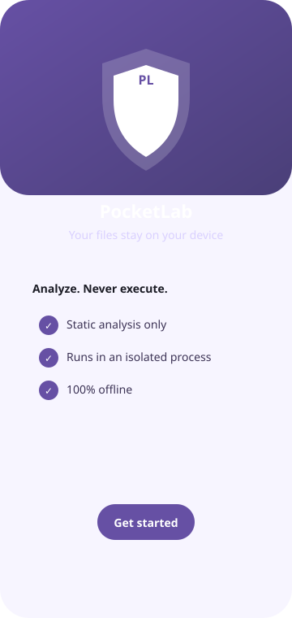
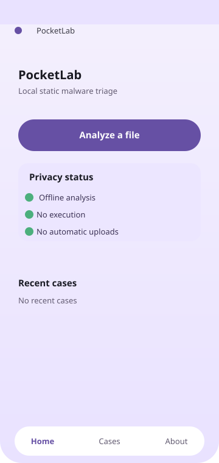
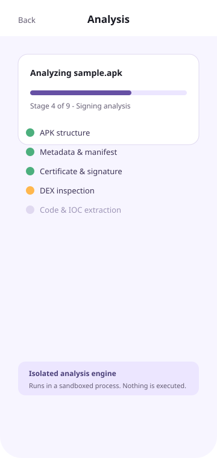
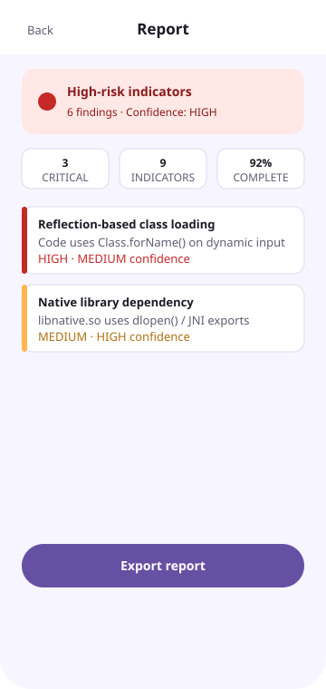
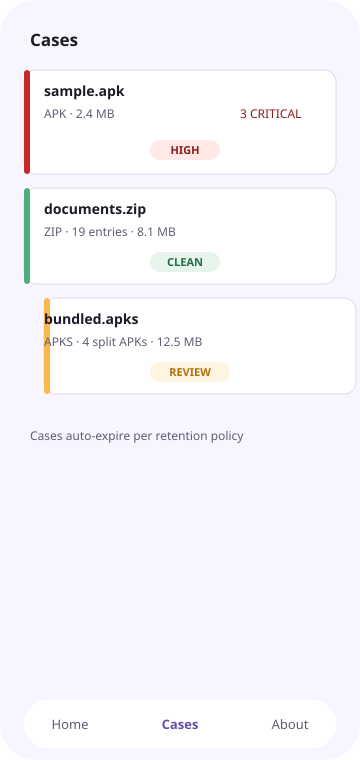

<div align="center">

# <!-- markdownlint-disable MD033 --><!-- markdownlint-disable MD041 -->
<a href="https://github.com/Pine-Packets/PocketLab">
  
</a>

# PocketLab

**Local-first Android static malware triage.**

Analyze APKs, DEX files, archives, and executables 100% offline — without installing, launching, executing, or uploading anything you import.

[](#build-from-source)
[](LICENSE)
[](build-logic)
[](https://kotlinlang.org)
[](https://developer.android.com/jetpack/compose)

</div>

> [!WARNING]
> **Always analyze in an isolated environment.** PocketLab is a static-analysis **triage** tool, not a substitute for malware research on a real sandbox. It never executes imported content, but you should still only import files you are authorized to examine.

---

## What is PocketLab?

PocketLab is a **local-first** static malware *triage* application for Android. It inspects user-selected files for indicators of malicious behavior and produces a structured report with severity, confidence, evidence, and clear limitations.

It is designed around one hard rule: **imported content is never installed, launched, executed, detonated, or automatically uploaded.** All analysis happens on-device, in an isolated process, with network access disabled.

<p align="center">
  
  
  
  
</p>

---

## Features

### 🔍 Multi-format detection & analysis
- **Magic-byte detection** (not just file extensions) for APK, DEX, ZIP, ELF/SO, PE (EXE/DLL), PDF, OLE (doc/xls/ppt), GZIP, 7z, RAR, and `APKS`.
- **APK pipeline**: manifest/metadata inspection, certificate & signature analysis, DEX inspection, and code-level indicator extraction.
- **Archive preflight**: ZIP enumeration, split-APK set (`APKS`) bundling, nested-container awareness.
- **ELF analysis**: sections, symbols, dynamic dependencies, and JNI exports.
- **IOC extraction**: domains, URLs, IPs, and hashes with container provenance.

### 🔎 Structured findings
- Findings with severity (`INFORMATIONAL` → `CRITICAL`), confidence, and simple-language explanations.
- **Risk band** summary (`NO_MAJOR_CONCERNS` through `HIGH_RISK_INDICATORS`, plus `ANALYSIS_INCOMPLETE`).
- Reports always separate **observed facts, interpretations, severity, confidence, evidence, parser errors, and limitations**.

### 🔒 Local-first & privacy by design
- **100% offline** — no internet access in the analysis path, no automatic uploads.
- **Isolated analysis process** (`isolatedProcess`, no permissions, no network — with mention and crash detection).
- Minimal permissions; no dangerous permissions requested.
- Encrypted report storage via **Android Keystore**.
- Samples and workspaces live in application-private storage and are **excluded from backup**.

### 🧪 Security-hardened parsing
- Every imported byte is treated as hostile.
- Hard limits on reads, allocations, decompression, recursion, loops, collection sizes, and analysis duration.
- Deterministic parser [fuzzing](core/testing) with fault classification, and bounded hostile-alloc hardening.
- Parser failures yield **incomplete-analysis** results, never false-clean results.

### ⚙️ Cases & retention
- Case-based workflow with per-case retention policy (session-only, 1/7/30 days, or retain).
- Sample and report hashes (SHA-256/SHA-1/MD5) but **never exported** without your action.

---

## Security & Privacy

PocketLab is built around enforced security invariants. See:

- **[SECURITY.md](SECURITY.md)** — security architecture and responsible-disclosure process.
- **[PRIVACY.md](PRIVACY.md)** — privacy policy and data-handling commitments.

---

## Getting Started

### Prerequisites
- **JDK 17**
- **Android SDK** with API 36 platform and build-tools.

### Build

```sh
git clone https://github.com/Pine-Packets/PocketLab.git
cd PocketLab

# place your SDK path in local.properties (gitignored)
echo "sdk.dir=/path/to/your/android-sdk" > local.properties

./gradlew assembleDebug
```

### Install

```sh
adb install app/build/outputs/apk/debug/app-debug.apk
```

### Run the tests

```bash
./gradlew test
./gradlew connectedCheck    # physical device or emulator required
./gradlew lintDebug
```

---

## Architecture

```
PocketLab
├── app/            Application shell, navigation, theming, manifest policy
├── core/           common / model / io / crypto / database / report / testing
├── engine/         api · service · orchestrator · pipeline
│                    filetype · archive · apk · dex · native · ioc · rules
└── feature/        onboarding · home · intake · analysis · report · cases · settings · about
```

Analysis runs through an **isolated `:analyzer` service process** (no permissions, no network) via read-only file descriptors, bounded callbacks, explicit budgets, and crash detection/recovery.

- **Core modules** are SDK-independent and contain the security-sensitive parsing logic.
- **engine modules** implement the isolated analysis pipeline.
- **feature modules** provide a thin Compose UI layer.

See **[docs/ARCHITECTURE.md](docs/ARCHITECTURE.md)** and the **[ADRs](docs/adr/)** for design decisions.

---

## Tech Stack

- **Language:** Kotlin
- **UI:** Jetpack Compose (Material 3)
- **Architecture:** Multi-module, MVVM (ViewModels + StateFlow)
- **Persistence:** Room + EncryptedSharedPreferences-backed settings (DataStore)
- **Crypto:** Android Keystore
- **Analysis:** Custom parser/analyzer engine modules with property-based and fuzz tests
- **Min / Target SDK:** 29 / 36 · Java 17

---

## Security & Vulnerability Disclosure

If you discover a security vulnerability in PocketLab, please report it responsibly per **[SECURITY.md](SECURITY.md)**. We follow a **coordinated disclosure** process.

Contact: `310212849+Pine-Packets@users.noreply.github.com`

---

## License

PocketLab is licensed under the [Creative Commons Attribution-NonCommercial-NoDerivatives 4.0 International](LICENSE) (CC BY-NC-ND 4.0).

> [!NOTE]
> This is a **non-commercial** license with **attribution required** and **no derivatives**. You may view, share, and study the source for non-commercial purposes with credit, but you may not use it commercially or distribute modified versions. The license is intentionally restrictive to protect the project at this stage.

---

Additional R&D workflows in the [`docs/`](docs/) folder (implementation status, threat model, privacy model, Play-Store review materials).